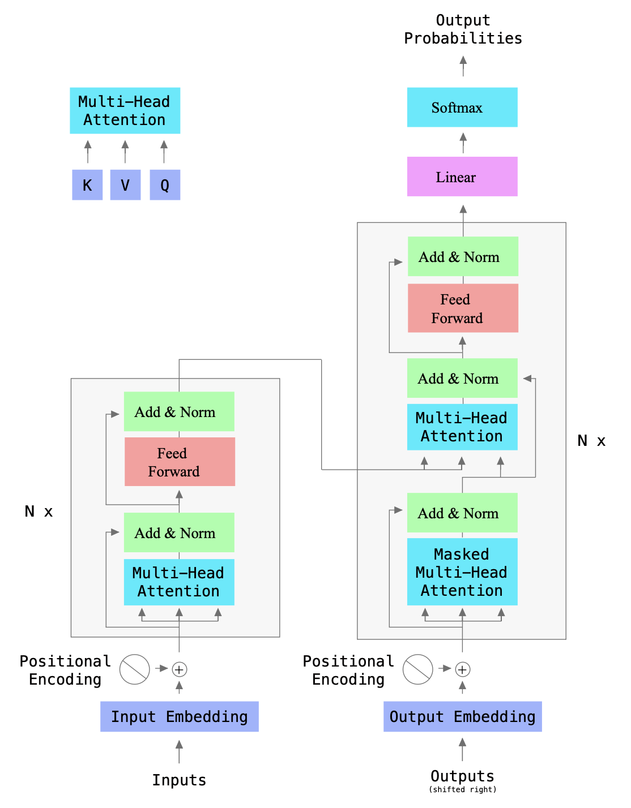

# Transformer

This repository provides an implementation of the original transformer encoder-decoder model described in the paper [Attention is All You Need](https://arxiv.org/pdf/1706.03762).

---

## **Model Architecture**

### **Encoder**

- The encoder is composed of **stack of identical layers** (typically 6).
- Each layer contains two main components:
  1. **Multihead Self-Attention Mechanism**
  2. **Position-Wise Fully Connected Feedforward Network**

### **Decoder**

- The decoder is also composed of **stack of identical layers** (typically 6).
- Each layer consists of three key components:
  1. **Multihead Masked Self-Attention Mechanism**
  2. **Multihead Cross-Attention Mechanism** (attends to the encoder output)
  3. **Position-Wise Fully Connected Feedforward Network**

- In the final decoder layer, the output is projected into a space of dimensionality `|V|` (the size of the vocabulary).

---

### **Key Details**

- **Residual connections** are used around each sublayer, followed by **layer normalization**:
  \[
  Y = \text{LayerNorm}(X + \text{layer}(X))
  \]
- **Dropout** is applied after each sublayer to avoid overfitting.
- **Multihead Attention Mechanisms** (Self, Masked, and Cross) utilize several **Scaled Dot-Product Attention (SDPA)** heads (typically 8) in parallel. The outputs of all SDPA heads are concatenated and projected to the desired output dimension.

---

## **Types of Attention**

In the transformer architecture, there are three distinct types of attention heads. When used in parallel, these form their respective **Multihead Attention Mechanisms**.

### 1. **Self-Attention (Encoder)**

- Used in the encoder, where all three matrices (Q, K, V) are computed from the same input — either the initial embeddings (in the first layer) or the output of the previous encoder layer (in subsequent layers).
- The embedding dimension and the dimension of the value vector are the same.
  
$$\[
H = [h_1, h_2, \dots, h_n]
\]$$
\[
Q = W_qH, \quad K = W_kH, \quad V = W_vH
\]
\[
Q = [q_1, q_2, \dots, q_n], \quad K = [k_1, k_2, \dots, k_n], \quad V = [v_1, v_2, \dots, v_n]
\]

\[
A = \text{Softmax}(QK^T)
\]
Where:
- \( A_{ij} = \text{score}(q_i, k_j) \)

\[
Y = AV
\]
And for each query \( y_m \):

\[
y_m = \sum_{i=1}^{n} \text{score}(q_m, k_i) \cdot v_i 
\]

---

### 2. **Masked Self-Attention (Decoder)**

- Used in the decoder, it operates similarly to self-attention, but with a crucial modification: the attention scores for any query are set to 0 for key vectors that correspond to future positions in the sequence.
  
- In other words:

\[
\text{score}(q_i, v_j) = 0 \quad \text{if} \, j > i
\]

- This ensures that the attention mechanism only considers past and current tokens, avoiding "peeking" at future tokens. As a result, the attention matrix is **lower triangular**.

---

### 3. **Cross-Attention (Decoder)**

- Cross-attention allows the decoder to focus on relevant parts of the encoder output. Here, the query matrix \( Q \) is derived from the decoder input, while the key \( K \) and value \( V \) matrices are computed from the encoder output.

\[
Q = W_q(\text{Decoder Input}), \quad K = W_k(\text{Encoder Output}), \quad V = W_v(\text{Encoder Output})
\]

- The attention mechanism works as usual, attending to the encoder output based on the decoder's current input.

---

